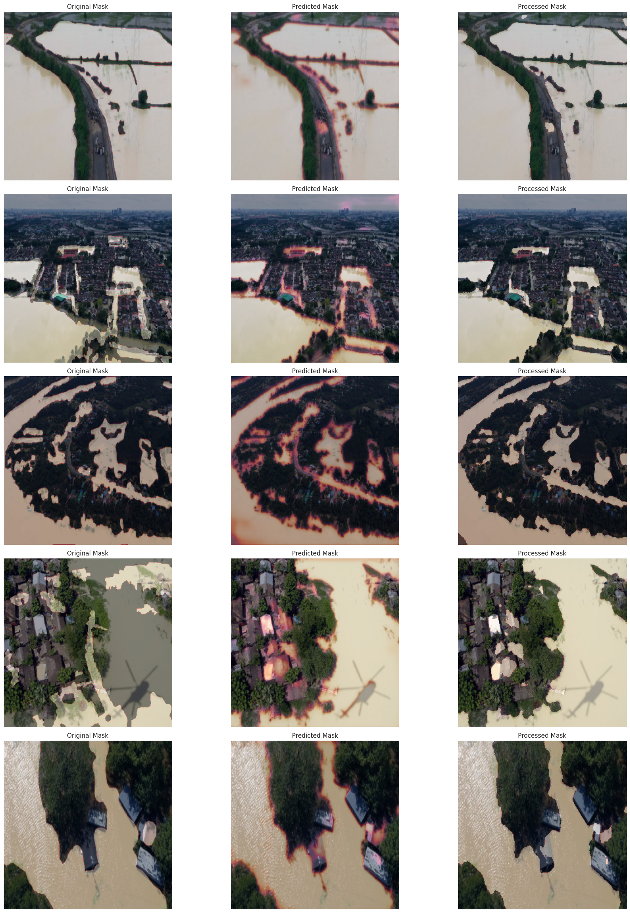

# ResQ 🚨 – AI-Powered Disaster Detection & Response System

**ResQ** is an end-to-end AI-powered system that detects floods and wildfires in real-time using satellite and drone imagery, and connects disaster victims to rescue teams through a user-friendly web application.

Built with a mission to save lives by reducing response times, ResQ integrates **Machine Learning models** and **a Web App interface** — ensuring help reaches victims faster, smarter, and when it’s needed the most.

🌐 **Try the Web App:** [https://resq.lovable.app](https://resq.lovable.app)

---

## 🚀 Features

### ML Model
- **Flood Detection Model:** Processes real-time satellite imagery (Sentinel-1 SAR & NOAA-20 VIIRS) to identify flood-affected areas with 92%+ accuracy.
- **Victim Detection Model:** Detects humans and animals in satellite or drone images and flags high-risk zones for prioritized rescue operations.

### Web Application
- **SOS Button:** Victims can send a distress signal instantly by pressing a single button.
- **Live Location Capture:** Captures user's live location and checks for disaster presence via satellite mapping.
- **Instant Alerting:** Automatically notifies NGOs, rescue teams, and authorities.
- **Community Posts:** Generates a live post with location and situation to help volunteers and communities act faster.
- **Shelter Mapping:** Displays nearest shelters and safe zones based on the detected disaster.
- **Rescue Tracking:** Victims can track the approaching rescue teams through animated map paths.

---

## 🧠 Technologies Used
- Python (for ML Models)
- Streamlit (for ML Model Deployment)
- Lovable.dev (for Web App Development)
- HTML/CSS/TypeScript
- React.js & Tailwind CSS
- Google Maps (for location display)
- Sentinel-1 SAR and NOAA-20 VIIRS Satellite Data
- Roboflow (for Victim Detection Dataset Training)
- Supabase (for backend and database)

---

## 📸 Showcase

| Flood Mapping Example | Wildfire Detection Example |
|:---------------------:|:---------------------------:|
|  |  |

